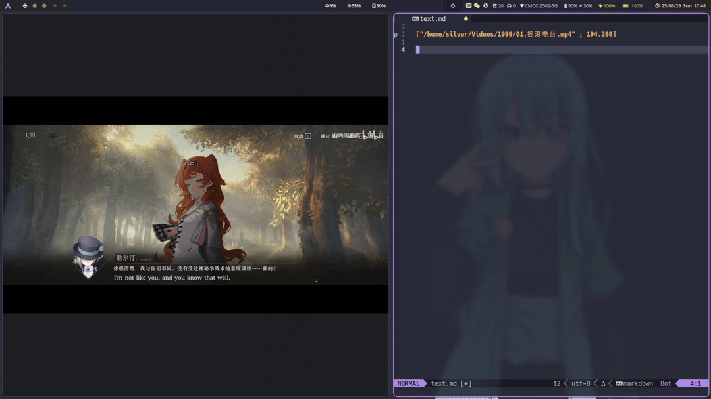

# 📼 MpvNote.nvim

[English](../README.md)/中文

一个为 Neovim 用户设计的小型插件，用于与 mpv 播放器交互，记录并回放视频时间戳。适用于剪辑笔记、课程记录、片段标注等场景。

# ✨ 插件功能

📋 复制时间戳：从 mpv 获取当前播放路径与时间戳，并复制为标准格式到剪贴板

📝 粘贴时间戳：将时间戳插入当前文件为新的一行

🎬 打开时间戳：点击时间戳可直接唤起 mpv 跳转播放该片段

# 🧩 时间戳格式

插件使用统一的时间戳格式：

```
["/path/to/video.mp4" ; 192.360]
```

第一个字段为视频路径

第二个字段为时间（秒），保留三位小数

# 🚀 使用方式

1. 启动 mpv 并启用 socket 控制

`mpv --input-ipc-server=/path/to/your/socket_file "/path/to/your/video"`

`socket_file` 默认为 `/tmp/mpvsocket`

2. 配置插件

使用 Lazy.nvim

```lua
return {
  "SilverofLight/MpvNote.nvim",
  lazy = true,
  cmd = { "MpvCopyStamp", "MpvPasteStamp", "MpvOpenStamp", "MpvHover" },
  dependencies = "folke/snacks.nvim", -- optional
  opts = {
    socket = "/tmp/mpvsocket", -- your socket file
    clipboard_cmd = "wl-copy", -- your clipboard tool command
    width = nil,
    height = nil, -- MpvHover's size
  },

  -- set your keybindings below
  vim.keymap.set("n", "<leader>mn", "<cmd>MpvCopyStamp<CR>", { desc = "Copy Mpv Note" }),
  vim.keymap.set("n", "<leader>mp", "<cmd>MpvPasteStamp<CR>", { desc = "Paste Mpv Note" }),
  vim.keymap.set("n", "<leader>mo", "<cmd>MpvOpenStamp<CR>", { desc = "Open Mpv Note" })
}
```

3. 提供的命令

`:MpvCopyStamp`

从 mpv 获取当前时间戳并复制到剪贴板

`:MpvPasteStamp`

从 mpv 获取时间戳并插入为当前行下的一行

`:MpvOpenStamp`

如果光标所在行为标准格式的时间戳，会调用 mpv 播放对应位置

若 mpv 没有运行，将自动以后台方式启动并跳转播放

`:MpvHover`

使用 Snacks.nvim 和 ffmpeg 提取并显示当前帧

`:MpvTogglePause`

暂停和开始播放

# 🛠 注意事项

插件依赖以下命令可用：

mpv（需开启 --input-ipc-server）

socat（用于 socket 通信）

剪贴板工具（如 wl-copy、pbcopy 等）

ffmpeg (可选, 用于 MpvHover)

folke/snacks.nvim -> image (可选，用于 MpvHover)

插件使用 JSON 通信协议，确保 mpv 版本支持 IPC。

# 📌 示例使用流程



在想记录的片段，运行 `:MpvCopyStamp`

粘贴到 markdown/笔记中 `:MpvPasteStamp`

随时光标移动到某行，使用 `:MpvOpenStamp` 回放该片段

# 📚 未来计划

支持多 socket / 多实例管理

# 📄 License

MIT License
